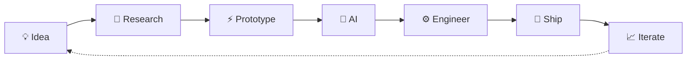

```markdown
<div align="center">

# `> AKSHAY WESLEY`

### I don't just use AI. I build systems around it.

**AI Engineer · Agent Builder · Full-Stack Developer**

Turning ambitious ideas into systems that **reason, automate, search, see, speak & ship.**

<br>

[](https://github.com/akshaywesleykothapalli)
[](mailto:akshaywesleyk@gmail.com)

</div>

---

```console
akshay@github:~$ whoami

> AI & Data Science student
> Building AI-native products and intelligent systems
> Interested in agents, GenAI, RAG, voice AI and ML
> I learn by shipping.
```

## ⚡ What happens when I get an idea?



I like problems where **AI isn't just a chatbot added on top**.

I want it inside the actual system — retrieving information, reasoning over data, understanding documents, processing vision, orchestrating tools, automating workflows and making software more intelligent.

---

# `01. /featured-builds`

## 🏛️ Government Intelligence Platform

> **What if thousands of government documents could behave like one intelligent knowledge system?**

An AI-native platform for transforming schemes, circulars, notifications and policy documents into structured, searchable intelligence.

```text
PDF / Scan
    │
    ▼
   OCR
    │
    ▼
AI Extraction ──────► Structured Knowledge
    │                        │
    ├──► Semantic Search     ├──► Knowledge Graph
    ├──► RAG                 ├──► Policy Intelligence
    └──► Citizen Guidance    └──► Officer Workflows
```

`Next.js` `FastAPI` `PostgreSQL` `pgvector` `OCR` `RAG` `LLMs` `NLP`

**Built around:** document intelligence · semantic retrieval · authentication · knowledge systems · AI-assisted workflows

---

## 🪐 Exoplanet Detector AI

> **Finding worlds hidden inside light curves.**

Machine-learning system for identifying potential exoplanets from astronomical transit data.

```text
        ⭐ STAR
          │
          │ brightness
          ▼
   ╭───────────────╮
───╯               ╰──────────
          ▲
          │
       🪐 transit
          │
          ▼
    ML CLASSIFIER
          │
      probability
          │
          ▼
   EXOPLANET CANDIDATE
```

Built using astronomical data, transit-light-curve analysis and machine learning.

`Python` `Machine Learning` `Scientific Computing` `Data Visualization`

[Explore the project →](https://github.com/akshaywesleykothapalli/exoplanet-detector-ai)

---

# `02. /currently-exploring`

```yaml
focus:
  ai:
    - Generative AI
    - AI Agents
    - Retrieval-Augmented Generation
    - Voice AI
    - Computer Vision

  engineering:
    - AI-native SaaS
    - Intelligent Backends
    - Distributed AI Systems
    - Developer Tools
    - Automation

  question:
    "What becomes possible when software can reason?"
```

---

# `03. /my-stack`

<div align="center">

### `LANGUAGES`


### `BUILD`


### `DATA + AI`


### `SHIP`


<br>

`LLMs` · `RAG` · `Embeddings` · `FAISS` · `pgvector` · `Hugging Face` · `Whisper` · `OCR`

</div>

---

# `04. /how-i-think`

```python
class Akshay:
    def __init__(self):
        self.role = "AI Builder"
        self.mode = "shipping"
        self.curiosity = float("inf")

    def build(self, problem):
        idea = research(problem)
        prototype = experiment(idea)
        product = engineer(prototype)

        return ship(product)

    def current_mission(self):
        return "Build things that weren't obvious yesterday."
```

---

# `05. /github-telemetry`

<div align="center">


</div>

---

# `06. /trajectory`

```text
NOW                                                     NEXT
 │                                                        │
 ├── Machine Learning                                     │
 ├── Full-Stack Development                               │
 ├── Generative AI                                        │
 │                                                        │
 └──────────────► AI Agents ──────► AI Systems ──────────►│
                                                          │
                                            Intelligent products
                                            people actually use.
```

---

<div align="center">

### `> BUILDING WHAT'S NEXT_`

I am interested in collaborating with people working on

**AI · Agents · GenAI · ML · Developer Tools · Intelligent Products**

<br>

[](mailto:akshaywesleyk@gmail.com)

<br><br>

<sub>Ideas are cheap. Execution compounds.</sub>

</div>
```
